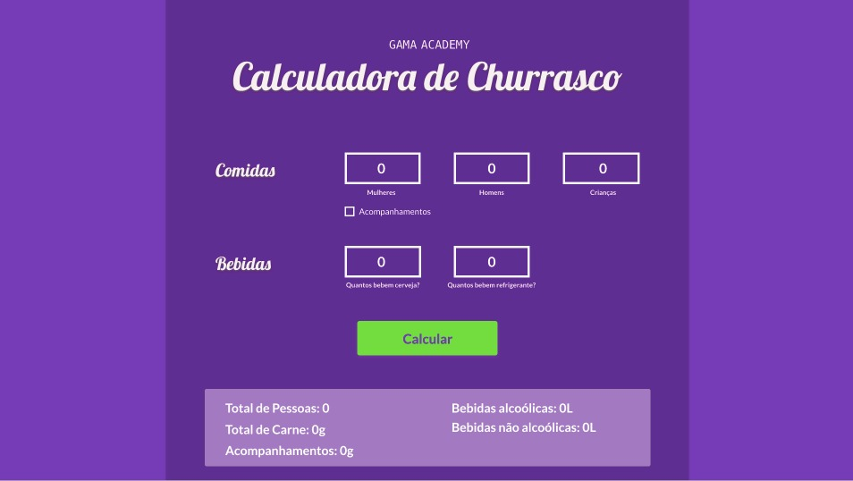

<h1 align="center">
    
</h1>

<h4 align="center"> 
	:heavy_check_mark: Atividade da primeira semana da turma Hacker da Gama Experience :heavy_check_mark:
</h4>

<p align="center">
    
</p>

## Sobre o Projeto 💻

Este projeto é destinado aos alunes da stack Hacker do Gama Experience. O projeto visa a criação de uma calculadora de churrasco que utilizará o número de pessoas para o resultado da quantidade necessária de carne, acompanhamentos e cerveja 🍺.

## Começando 🏁

Para conseguir utilizar o template basta fazer o download do projeto ou clonar este repositório utilizando o Git em seu terminal.

## Observações 📌

No template temos a lógica do calculo criada e os campos definidos, mas sinta-se a vontade para fazer alterações :D
Para agilizar o desenvolvimento, criamos também um wireframe para você seguir e não se preocupar com design. Os dados de cores, tamanhos e fontes constam [nesse arquivo](https://xd.adobe.com/view/dbdc850b-ce84-4227-67b7-ac0974fda9a6-aded/).

<p align="center">
    
</p>

```bash

# Clone this repository
$ git clone https://github.com/PedroSato/gama-academy-calculadora-churrasco
```

### Pré-requisitos :large_orange_diamond:

- Editor de texto de sua preferência. (Aqui na Gama utilizamos o [VSCode](https://code.visualstudio.com))

### Criado por:

- Equipe Gama Academy && [@michellehorn](https://github.com/michellehorn)
